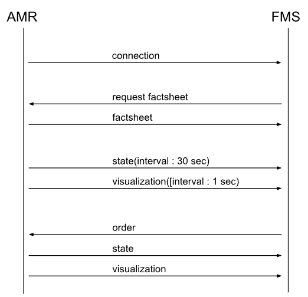

# 소개
- test_amr_emulator는 차량없이 FMS-AMR의 연결테스트를 가능하게 함
# 사용법
- Terminal 실행
- 파라메터(amr_params.yaml) 수정
```
$vim ~/test_amr_emulator/config/amr_params.yaml
```
  - mqtt서버주소
```
mqtt:
  server_address: "tcp://localhost:1883"
```
  - 차량크기
```
amr_params:
  width: 2.9
  length : 15.0
```
  - 토픽전송주기(visualization, state)
```
mqtt:
  visualization_publish_period : 1  # 1[sec]
  state_publish_period : 3         # 30[sec]
```

- emulator 실행
```
$./run.sh
```

# 통신 시퀀스


#ToDO
- 통신인터페이스 - done
- 주행
- 안전
- 진단도구
- 멀티 인스턴스

#Q&A
https://docs.google.com/spreadsheets/d/17JYczG-rZVLQ3X0q1K-b3GDb2ZMyI-NT3-7OrI3WKLs/edit?gid=0#gid=0


